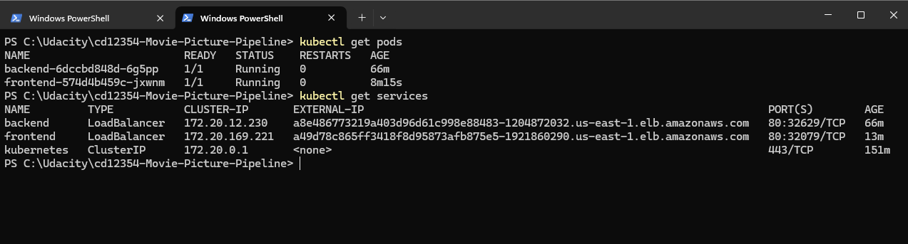
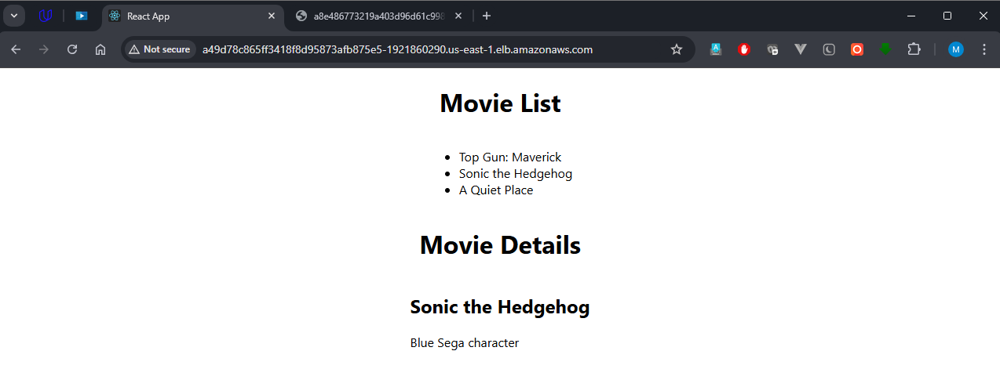
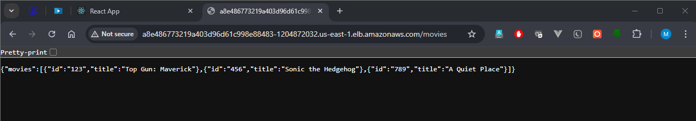
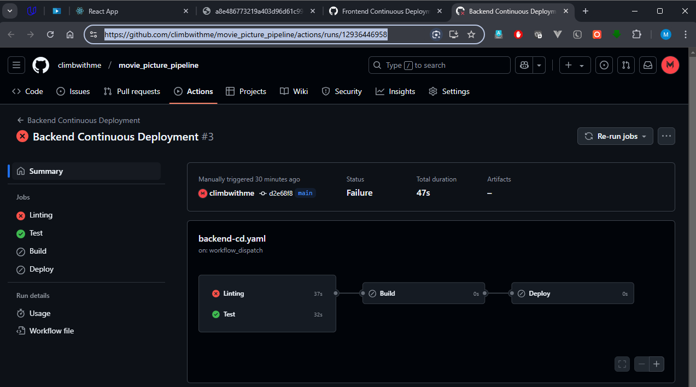
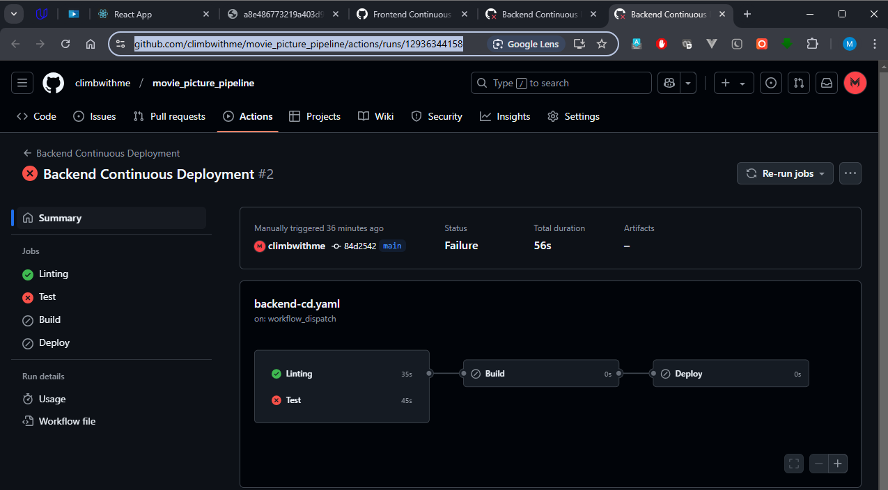
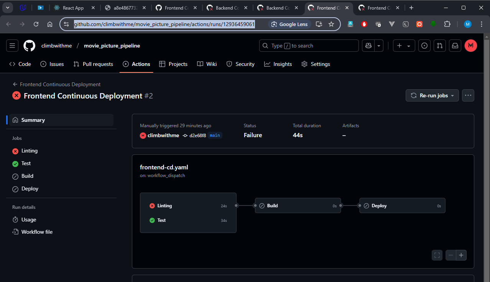
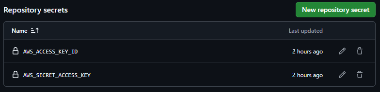
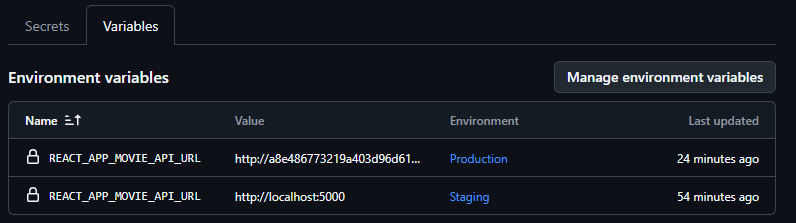

# Movie Picture Pipeline

## Application URLs

- **Frontend:** [http://a49d78c865ff3418f8d95873afb875e5-1921860290.us-east-1.elb.amazonaws.com/](http://a49d78c865ff3418f8d95873afb875e5-1921860290.us-east-1.elb.amazonaws.com/)

- **Backend:** [http://a8e486773219a403d96d61c998e88483-1204872032.us-east-1.elb.amazonaws.com/movies](http://a8e486773219a403d96d61c998e88483-1204872032.us-east-1.elb.amazonaws.com/movies)

## Evidences: 

### 1. Kubectl statuses:

### 2. Frontend:

### 3. Backend:

### 4. Negative Testing:

- **Backend - Failed Lint:** [https://github.com/climbwithme/movie_picture_pipeline/actions/runs/12936446958](https://github.com/climbwithme/movie_picture_pipeline/actions/runs/12936446958)

- **Backend - Failed Test:** [https://github.com/climbwithme/movie_picture_pipeline/actions/runs/12936344158](https://github.com/climbwithme/movie_picture_pipeline/actions/runs/12936344158)

- **Frontend - Failed Lint:** [https://github.com/climbwithme/movie_picture_pipeline/actions/runs/12936459061](https://github.com/climbwithme/movie_picture_pipeline/actions/runs/12936459061)

- **Frontend - Failed Test:** [https://github.com/climbwithme/movie_picture_pipeline/actions/runs/12936363289](https://github.com/climbwithme/movie_picture_pipeline/actions/runs/12936363289)

### 5. Environment Configuration:

